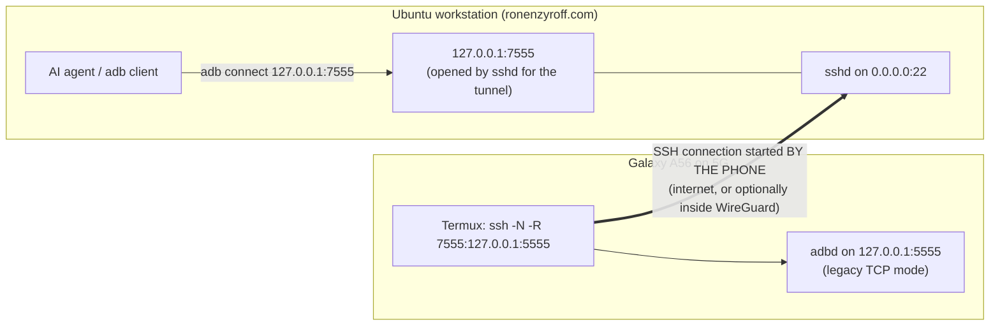
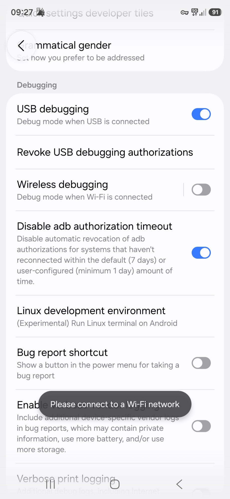
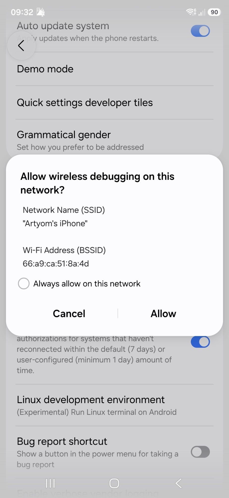
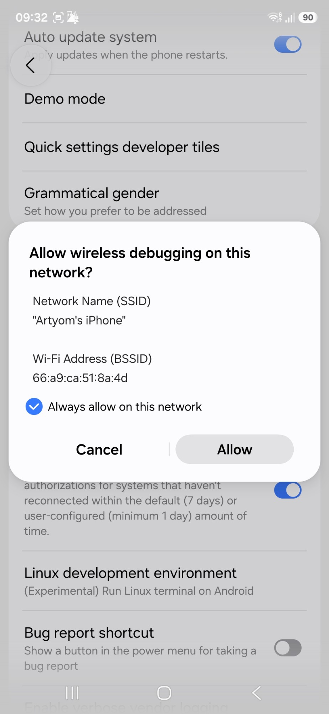
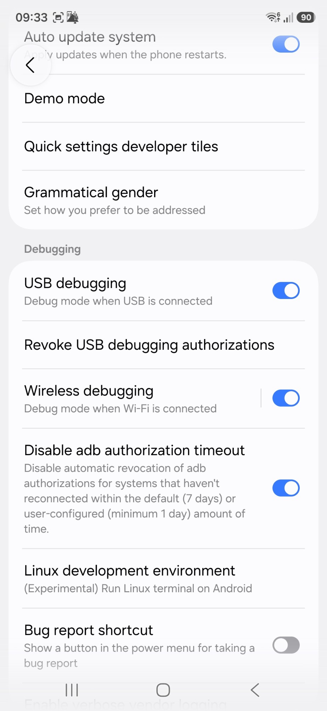
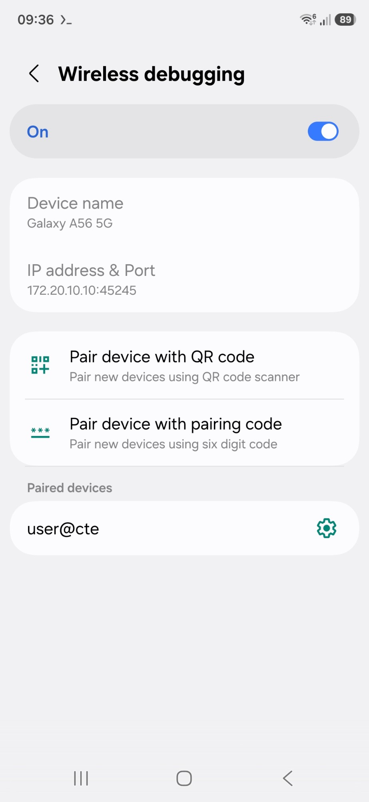

# Remote adb for a Samsung Galaxy A56 over 5G (via a reverse SSH tunnel)

This repository records, step by step, how a **non-rooted Samsung Galaxy A56 5G**
was made controllable with **`adb`** from an **Ubuntu workstation**, while the
phone is **anywhere on mobile data (5G)**. The goal is to let an AI coding
agent running on the workstation (Claude Code CLI, Codex CLI, …) drive the phone:
run shell commands, take screenshots, tap, type, and mirror the screen.

It was done on **2026-09-28**. Every screenshot and every Terminal output below
comes from that session. Nothing here is secret, and the security of the setup
doesn't depend on it being secret (see [Security model](#10-security-model)).

> **Status as of writing**
>
> Steps 1-9 were performed and their outputs are recorded below and in
> [`logs/termux-session.txt`](logs/termux-session.txt).
>
> Step 9 ended with the reverse SSH tunnel established: the password was
> accepted and ssh went silent.
>
> The workstation-side Step 10 (`adb connect 127.0.0.1:7555`) was the next
> action. Its output was **not** captured before this README was written.

---

## Contents

1. [The result in one picture](#1-the-result-in-one-picture)
2. [Words used in this document](#2-words-used-in-this-document)
3. [The equipment and software](#3-the-equipment-and-software)
4. [Why it is built this way](#4-why-it-is-built-this-way)
5. [One-time preparation](#5-one-time-preparation)
6. [The walkthrough, step by step](#6-the-walkthrough-step-by-step)
7. [Using it from an AI agent](#7-using-it-from-an-ai-agent)
8. [Routine: every time, and after every reboot](#8-routine-every-time-and-after-every-reboot)
9. [Troubleshooting](#9-troubleshooting)
10. [Security model](#10-security-model)
11. [Limitations and known future risks](#11-limitations-and-known-future-risks)
12. [Repository layout and sources](#12-repository-layout-and-sources)

---

## 1. The result in one picture



In words:

1. **adbd on port 5555.** The phone's adb daemon (**adbd**) is switched into an
   older mode where it listens on TCP port **5555**. That mode keeps working on
   mobile data until the phone reboots.
2. **The phone opens the SSH connection.** **Termux**, a Linux terminal app on
   the phone, starts an **SSH connection out to the workstation** and asks the
   workstation's SSH server for a "reverse port forward". From then on, anything
   that connects to `127.0.0.1:7555` on the workstation is carried through that
   SSH connection to `127.0.0.1:5555` on the phone.
3. **The workstation connects to itself.** The agent on the workstation runs
   `adb connect 127.0.0.1:7555`, which reaches the phone's adbd through the
   tunnel.

The phone starts the connection because a phone on 5G sits behind the carrier's
NAT and can't accept incoming connections. It can always make outgoing ones.

---

## 2. Words used in this document

| Term | Meaning |
|---|---|
| **adb** | *Android Debug Bridge.* The command-line tool on a computer that talks to an Android device: shell, install apps, screenshots, input. |
| **adbd** | The adb *daemon*: the service **on the phone** that adb connects to. |
| **USB debugging** | Developer option that lets adbd run. Despite the name, it also has to stay on for the network mode used here ([why](docs/android-research.md#4-why-usb-debugging-must-stay-on)). |
| **Wireless debugging** | Android 11+ feature: adb over Wi-Fi, encrypted (TLS), with one-time pairing by a 6-digit code. It works **only while connected to Wi-Fi** ([why](docs/android-research.md#2-wireless-debugging-requires-wi-fi-and-turns-itself-off)). |
| **Legacy TCP mode** | The older `adb tcpip 5555` mode. adbd listens on a fixed TCP port on every interface, regardless of Wi-Fi, until the phone reboots. |
| **Pairing** | One-time trust setup for Wireless debugging: the phone shows a code and a port, and the computer runs `adb pair`. |
| **Authorization** | The "Allow USB debugging?" prompt. The phone remembers each computer's adb key once you tap Allow with "Always allow". |
| **Termux** | A terminal app for Android that provides a real Linux userland (`pkg install …`), including `adb` and `ssh`. |
| **SSH reverse forward (`ssh -R`)** | The SSH client asks the SSH **server** to listen on a port and send whatever connects there back through the SSH connection to a destination on the **client** side. |
| **Loopback, `127.0.0.1`** | "This same machine." On the phone it means the phone; on the workstation it means the workstation. |
| **SSID / BSSID** | A Wi-Fi network's name, and the hardware address of the specific access point. Android approves Wireless debugging per **BSSID**. |
| **Hotspot** | A phone sharing its mobile data over Wi-Fi. Joining *someone else's* hotspot counts as Wi-Fi; hosting your own does not. |
| **WireGuard** | The VPN from [mobile-egress-wireguard](https://github.com/BigBIueWhale/mobile-egress-wireguard), running on the workstation. **Optional** here ([§4.5](#45-wireguard-is-optional)). |

---

## 3. The equipment and software

| Piece | Details |
|---|---|
| **Phone** | Samsung Galaxy A56 5G, **not rooted**, official Samsung firmware (One UI 8.x / Android 16 era; the exact build wasn't recorded, see *Settings → About phone → Software information*). Was on **5G** mobile data. |
| **Termux** (phone) | Already installed. Packages used: `android-tools` **35.0.2-7** (adb), `openssh` **10.3p1-1** (ssh), from the `termux.net` stable repository. |
| **WireGuard app** (phone) | Official app from Google Play, with a profile from [mobile-egress-wireguard](https://github.com/BigBIueWhale/mobile-egress-wireguard). **Optional.** |
| **Workstation** | Ubuntu 24.04, set up with [BigBIueWhale/personal_server](https://github.com/BigBIueWhale/personal_server). adb was already installed. |
| **Workstation SSH server** | From personal_server's [`scripts/05_install_openssh_server.sh`](https://github.com/BigBIueWhale/personal_server/blob/421dd38cd570ea5737c995856c31bb4f471f548d/scripts/05_install_openssh_server.sh): socket-activated OpenSSH on `0.0.0.0:22` (IPv4 only), **password login only** (`PubkeyAuthentication no`), single allowed account `user`. |
| **Network** | The workstation has a static LAN IPv4 (personal_server default `10.0.0.200`). The home router puts it in **full DMZ** (every incoming port and protocol is forwarded to it). It is reachable as **`ronenzyroff.com`**. |
| **Temporary Wi-Fi** | A friend's iPhone hotspot ("Artyom's iPhone"), needed once to bootstrap, because Wireless debugging refuses to start without Wi-Fi. |

---

## 4. Why it is built this way

### 4.1 Why not connect adb straight to the phone's WireGuard address?

The WireGuard setup is **deliberately one-way**:

- **Phone-started connections work.** The phone can start connections to the
  internet, the LAN, the workstation, and the Haggai container.
- **Workstation-started connections don't.** Nothing on the workstation side
  can start a connection *to* the phone:
  - the host has no route to the tunnel's `10.77.0.0/24` addresses;
  - the VPN container's firewall only lets **replies** go toward phones.

Full packet-by-packet analysis, with links to the exact firewall lines:
[`docs/why-not-directly-over-wireguard.md`](docs/why-not-directly-over-wireguard.md).

So instead of opening that path, **the phone starts the connection** (SSH), and
the workstation's adb rides back through it.

### 4.2 Why not Wireless debugging by itself?

- It **cannot be turned on over mobile data**
  ([screenshot 01](#step-1--try-wireless-debugging-on-5g-refused)).
- It **turns itself off** the moment Wi-Fi drops or you move to another access
  point.
- Its port is **random** and changes every time it starts.

Source-level details:
[`docs/android-research.md` §2](docs/android-research.md#2-wireless-debugging-requires-wi-fi-and-turns-itself-off).

### 4.3 Why legacy TCP mode (`adb tcpip 5555`)?

- **It isn't tied to Wi-Fi.** Once switched on, it keeps listening on port 5555
  on **every** interface, including the phone's own `127.0.0.1` and mobile
  data, **until the phone reboots**.
- **It can be switched on without a cable.** Wireless debugging can be used
  **once** to send the `tcpip 5555` command.

That's why Wi-Fi is needed only briefly, once per reboot. Details:
[§3 of the research notes](docs/android-research.md#3-legacy-tcp-mode-adb-tcpip-5555).

### 4.4 Why the phone starts an SSH tunnel

- **The phone can't be reached from outside.** On 5G it's behind carrier NAT,
  so incoming connections are impossible, while outgoing ones always work.
- **The workstation already accepts SSH from the internet.** personal_server
  runs OpenSSH on port 22, and the router's DMZ forwards it.
- **Remote forwarding is allowed:**
  - personal_server doesn't set `AllowTcpForwarding` or `DisableForwarding`,
    so OpenSSH's default (forwarding allowed) applies;
  - `GatewayPorts` is left at its default of `no`, so the forwarded port opens
    **only on the workstation's `127.0.0.1`**, never on its LAN or internet
    side.

### 4.5 WireGuard is optional

Because personal_server's SSH port is already exposed to the internet through
the router's DMZ, **WireGuard is purely optional** for this setup. Termux can
SSH straight to `user@ronenzyroff.com` over 5G, and that's what we did.

Turn WireGuard on before starting the SSH tunnel **only if you want connection
persistence**:

- **Survives network switches.** The tunnel's inner addresses don't change
  when the phone switches between Wi-Fi and 5G. The SSH session therefore
  survives the switch instead of dropping and needing to be restarted.
- **Gets through port-22 blocks.** It also works on networks that block
  outgoing port 22, because WireGuard uses UDP/443.

Pick **one** of these pairs, and don't mix them:

| WireGuard on the phone | SSH target in the Termux command |
|---|---|
| **Off** (what we did) | `user@ronenzyroff.com` |
| **On** (for persistence) | `user@172.30.77.1`: the workstation's address on the VPN's internal Docker network, fixed by [mobile-egress-wireguard's `compose.yaml`](https://github.com/BigBIueWhale/mobile-egress-wireguard/blob/35c2261a8a819090f1440059fd12c097af9485c7/compose.yaml#L107) |

With WireGuard **on**, don't use `ronenzyroff.com`: the traffic would leave
through the home router and have to come straight back in, which only works if
the router supports NAT loopback. The first time you use `172.30.77.1`, ssh asks
you to confirm the host fingerprint. It's the same machine, so the fingerprint
should match the one you know for `ronenzyroff.com`.

### 4.6 Why port 7555 on the workstation (and not 5555)

The adb **client** on a computer treats local ports **5555-5585** as
Android-emulator ports and probes them automatically. Using `7555` on the
workstation avoids that confusion. On the phone side the port stays 5555.

---

## 5. One-time preparation

### 5.1 On the phone

1. **Enable Developer options.** Settings → About phone → Software information
   → tap **Build number** seven times.
2. In **Settings → Developer options**, as seen in
   [screenshot 01](screenshots/01-wireless-debugging-refused-on-5g.jpg):
   - **USB debugging: ON.** This is required even with no cable: it keeps adbd
     (and port 5555) alive after Wireless debugging switches itself off
     ([source](docs/android-research.md#4-why-usb-debugging-must-stay-on)).
   - **Disable adb authorization timeout: ON.** Otherwise Android forgets an
     authorized computer after 7 days without a connection
     ([source](docs/android-research.md#7-authorization-lifetime)).
3. **Samsung Auto Blocker must not block debugging.** It lives at Settings →
   Security and privacy → Auto Blocker, and it's on by default on the A56.
   - If USB debugging is greyed out, or Wireless debugging won't stay on, turn
     Auto Blocker off.
   - In our session USB debugging was already on and working.
4. **Install Termux.** Termux was already installed; its welcome banner points
   to `doc.termux.com`.
5. **Keep Android from killing Termux in the background.** In Samsung's battery
   settings, add Termux to **Never sleeping apps**: Settings → Battery →
   Background usage limits (menu names vary slightly between One UI versions).
   The `termux-wake-lock` command used later helps too.
6. **Optional: turn off Samsung's automatic restarts,** because a reboot closes
   port 5555. Look under Settings → Device care → Auto optimization → "Restart
   when needed", and any scheduled auto-restart. Menu names vary slightly
   between One UI versions.

### 5.2 On the workstation

- **adb:** installed already. If not, `sudo apt install adb`; personal_server
  doesn't install it.
- **SSH server:** as set up by personal_server
  ([`05_install_openssh_server.sh`](https://github.com/BigBIueWhale/personal_server/blob/421dd38cd570ea5737c995856c31bb4f471f548d/scripts/05_install_openssh_server.sh)).
  Nothing was changed for this project.

---

## 6. The walkthrough, step by step

The verbatim Termux output of the whole session is in
[`logs/termux-session.txt`](logs/termux-session.txt).

### Step 1 — Try Wireless debugging on 5G (refused)

**What we did:** with the phone on 5G (and WireGuard connected; notice the key
icon in the status bar), tapped the **Wireless debugging** switch.

**What happened:** a toast said **"Please connect to a Wi-Fi network"** and the
switch stayed off.



**Why:** Android only allows Wireless debugging while connected to Wi-Fi as a
client. The code explicitly refuses when there's no Wi-Fi network
(`"Not connected to any wireless network. Not enabling adbwifi."`, see the
[research notes](docs/android-research.md#2-wireless-debugging-requires-wi-fi-and-turns-itself-off)).

- **VPN doesn't count.** WireGuard being up makes no difference.
- **Your own hotspot doesn't count.** Hosting a hotspot on this phone doesn't
  count as Wi-Fi either.

### Step 2 — Join any Wi-Fi as a client, and allow Wireless debugging on it

**What we did:**

1. Connected the phone to a **friend's iPhone hotspot** ("Artyom's iPhone").
   Home Wi-Fi, café Wi-Fi, or a laptop's hotspot would work just as well.
2. Tapped the Wireless debugging switch again.
3. Android asked **"Allow wireless debugging on this network?"** and showed the
   network's SSID and BSSID.
4. Ticked **"Always allow on this network"** and tapped **Allow**.

  

**Why:**

- **Android approves each network.** Android trusts networks by **BSSID**, the
  hardware address of that specific access point.
- **"Always allow" skips the question next time.** Android stores that BSSID
  as trusted, so it won't ask again on the same hotspot. That matters after
  every reboot (see [§8](#8-routine-every-time-and-after-every-reboot)).

**Result:** Wireless debugging **On** (third screenshot).

### Step 3 — Read the Wireless debugging details

**What we did:** tapped the **words** "Wireless debugging" (not the switch) to
open its page.



**What it shows:**

- **IP address & Port `172.20.10.10:45245`:**
  - `172.20.10.x` is the address range iPhone hotspots hand out;
  - **`45245` is Wireless debugging's random connection port**, which changes
    every time Wireless debugging restarts.
- **Pair device with pairing code:** used in Step 5.
- **Paired devices: `user@cte`:** a pairing that already existed before this
  session. Termux gets added as a new entry in Step 5. If you ever see an entry
  you don't recognize, tap its gear icon and choose **Forget**.

### Step 4 — Install adb inside Termux

```sh
pkg install android-tools
```

The output ended with `Setting up android-tools (35.0.2-7) ...` (full output in
the [log](logs/termux-session.txt)).

**Why:** the phone needs its own adb **client** to send the one command that
switches adbd into legacy TCP mode (Step 6). Termux's `android-tools` package
provides it.

### Step 5 — Pair Termux's adb with the phone

**How:**

1. **Put Settings and Termux side by side (split screen).**
   - Tap the **|||** (Recents) button.
   - Tap the small **app icon** at the top of the Termux card and choose
     **Open in split screen view**.
   - Pick **Settings** for the other half, and open the Wireless debugging page
     there.
2. In Settings, tap **Pair device with pairing code**. A dialog shows a
   6-digit **Wi-Fi pairing code** and an **IP address & Port**. That port is a
   different, random pairing port, not 45245.
3. In Termux, type **both** numbers from the dialog:

```console
~ $ adb pair 172.20.10.10:46285 934495
* daemon not running; starting now at tcp:5037
* daemon started successfully
Successfully paired to 172.20.10.10:46285 [guid=adb-R5GYC5E7KTJ-ktZCd0]
```

(That code and port were single-use and have long expired.)

**Why each part:**

- **Split screen is required.** The pairing dialog closes, and the code dies,
  as soon as Settings leaves the screen. For the same reason it's pointless to
  screenshot the dialog and send it to someone: by the time they answer, the
  code is gone.
- **Nobody else can pick the numbers for you.** The code and pairing port are
  generated fresh every time the dialog opens, so they must be read off the
  screen.
- **`daemon not running; starting now`** is normal. Termux's adb starts its own
  background server the first time you use it.
- **Pairing only needs to be done once.** With "Disable adb authorization
  timeout" on, the pairing doesn't expire.

### Step 6 — Connect over Wireless debugging and switch adbd to port 5555

```console
~ $ adb connect 172.20.10.10:45245
connected to 172.20.10.10:45245
~ $ adb -s 172.20.10.10:45245 tcpip 5555
restarting in TCP mode port: 5555
```

**Why:**

- **Which ports to use:** `45245` is the connection port from Step 3. `-s`
  picks which connected device the command goes to.
- **What `tcpip 5555` does:** it tells adbd to restart in **legacy TCP mode**
  on port **5555**. The reply text comes straight from adbd's source
  ([`restart_service.cpp` L64-L65](https://github.com/mirror/platform_packages_modules_adb/blob/android-16.0.0_r4/daemon/restart_service.cpp#L64-L65)).
- **What it sets:** a non-persistent system property (`service.adb.tcp.port`).
  It lasts **until the next reboot**.

### Step 7 — Check port 5555 from the phone itself

```console
~ $ adb connect 127.0.0.1:5555
connected to 127.0.0.1:5555
~ $ adb devices
List of devices attached
127.0.0.1:5555  device
172.20.10.10:45245      offline

~ $ adb disconnect 172.20.10.10:45245
error: no such device '172.20.10.10:45245'
```

**What this proves:** adbd now answers on the phone's own loopback address
`127.0.0.1:5555`. It listens on every interface
([source](docs/android-research.md#1-where-adb-listens-on-the-phone)).
`device` means authorized and working.

**The two odd lines are harmless:**

- **`offline`:** the old Wireless debugging connection died when adbd
  restarted.
- **`no such device`:** by the time `disconnect` ran, adb had already dropped
  that stale entry.

### Step 8 — Leave Wi-Fi and prove port 5555 survives on 5G

**What we did:** turned **Wi-Fi off**, so the phone was on 5G only. Then:

```console
~ $ adb disconnect
disconnected everything
~ $ adb connect 127.0.0.1:5555
connected to 127.0.0.1:5555
~ $ adb devices
List of devices attached
127.0.0.1:5555  device
```

**Why it still works:**

- **Wireless debugging switched itself off** when Wi-Fi went away, as
  expected.
- **adbd stayed alive** because **USB debugging is on**. Android only stops
  adbd when *both* USB debugging and Wireless debugging are off
  ([`AdbService.java` L392-L393](https://github.com/LineageOS/android_frameworks_base/blob/lineage-23.2/services/core/java/com/android/server/adb/AdbService.java#L392-L393)).
- **Legacy TCP mode ignores network changes**, so port 5555 stays open on 5G.

**This is the key result:** from here until the next reboot, **no Wi-Fi is
needed**.

### Step 9 — Open the reverse SSH tunnel from Termux

WireGuard on or off both work ([§4.5](#45-wireguard-is-optional)). This session
used the public name.

```console
~ $ pkg install openssh
openssh is already the newest version (10.3p1-1).
~ $ termux-wake-lock
~ $ ssh -N -o ExitOnForwardFailure=yes -o ServerAliveInterval=30 -R 7555:127.0.0.1:5555 user@ronenzyroff.com
user@ronenzyroff.com's password:
Permission denied, please try again.
user@ronenzyroff.com's password:
```

- **First password attempt:** mistyped. Passwords don't echo, and phone
  keyboards like to auto-capitalize.
- **Second attempt:** accepted. After that **ssh prints nothing and keeps
  running. That silence means success.** Leave Termux open.

What each part does:

| Part | Meaning |
|---|---|
| `termux-wake-lock` | Asks Android to keep Termux awake while the screen is off, so the tunnel isn't frozen in the background. Undo with `termux-wake-unlock`. |
| `ssh … user@ronenzyroff.com` | Log in to the workstation's SSH server as `user` (password login, the only method personal_server allows). |
| `-N` | Don't run a remote shell; just keep the connection open for forwarding. |
| `-R 7555:127.0.0.1:5555` | On the **workstation**, listen on port `7555`. Send each connection through this SSH session to `127.0.0.1:5555` **on the phone** (adbd). With the server's default `GatewayPorts no`, the workstation listens only on its own `127.0.0.1:7555`. |
| `-o ExitOnForwardFailure=yes` | If the workstation can't open port 7555 (for example, an old tunnel still holds it), quit with an error instead of pretending to work. |
| `-o ServerAliveInterval=30` | Send a small keep-alive every 30 s so carrier NAT doesn't silently drop an idle connection, and so a dead link is noticed. |

### Step 10 — Connect from the workstation (the agent's side)

On the Ubuntu workstation:

```sh
adb connect 127.0.0.1:7555
adb devices
```

**Expected:**

1. The phone shows **"Allow USB debugging?"** with the workstation's key
   fingerprint. This is the first time *this* computer's key is used in
   legacy TCP mode.
2. Tick **Always allow from this computer** and tap **Allow**.
3. `adb devices` then shows:

```
List of devices attached
127.0.0.1:7555  device
```

If it shows `unauthorized`, accept the prompt on the phone and run
`adb devices` again.

> This step's real output was **not** captured during the session (see the
> status note at the top). If you run it, paste the result here.

---

## 7. Using it from an AI agent

**Give the agent [`AGENT_BRIEFING.md`](AGENT_BRIEFING.md).** It's written to
the agent, and covers:

- what changed compared with USB;
- commands it must never run, because they would cut the link;
- how to detect a disconnect;
- the exact instructions to give you for each failure case, instead of retrying
  forever.

A one-line prompt that works:

> Read `AGENT_BRIEFING.md` in https://github.com/BigBIueWhale/samsung_a56_remote_usb_debugging (branch `master`) and follow it for all phone work from now on. The phone is `127.0.0.1:7555`.

The device serial is `127.0.0.1:7555`. Setting it once saves typing `-s` on
every command:

```sh
export ANDROID_SERIAL=127.0.0.1:7555
```

Useful commands:

```sh
adb shell getprop ro.product.model                   # sanity check: prints the model
adb exec-out screencap -p > screen.png               # screenshot to the workstation
adb shell input tap 540 1200                         # tap at x=540, y=1200 (pixels)
adb shell input swipe 540 1600 540 400 300           # swipe up over 300 ms
adb shell input text 'hello'                         # type text into the focused field
adb shell input keyevent KEYCODE_HOME                # Home button
adb shell uiautomator dump /sdcard/ui.xml && adb pull /sdcard/ui.xml   # on-screen UI tree
scrcpy -s 127.0.0.1:7555 --max-size 1024 --video-bit-rate 2M          # live mirror + control, if scrcpy is installed
```

scrcpy works through the tunnel because its video and control streams travel
inside the adb connection. The lower size and bit rate suit 5G upload speeds.

---

## 8. Routine: every time, and after every reboot

### Each time you want the agent to have the phone (no reboot since the last setup)

1. **Optional: turn WireGuard on** for a more persistent connection
   ([§4.5](#45-wireguard-is-optional)).
2. In Termux, open the tunnel. Use `user@172.30.77.1` instead if WireGuard is
   on:

   ```sh
   termux-wake-lock
   ssh -N -o ExitOnForwardFailure=yes -o ServerAliveInterval=30 -R 7555:127.0.0.1:5555 user@ronenzyroff.com
   ```

3. Type the password. It goes silent; leave it running.
4. On the workstation: `adb connect 127.0.0.1:7555`.

**To stop:** press **Ctrl+C** in Termux (Termux's extra-keys row has CTRL),
then run `termux-wake-unlock`.

### After the phone reboots

A reboot closes port 5555. Redo the bootstrap:

1. **Join any Wi-Fi as a client.** Your own hotspot doesn't count.
   - If it's a network you ticked "Always allow" on (for example the same
     friend's hotspot), there's no prompt.
   - Otherwise, tap Allow as in Step 2.
2. Turn on **Wireless debugging**, open its page, and read the new
   **IP address & Port**.
3. In Termux, using the new values from that page:

   ```sh
   adb connect <IP>:<PORT>
   adb -s <IP>:<PORT> tcpip 5555
   ```

   **Pairing (Step 5) is not needed again** unless you pressed Forget or
   revoked authorizations.
4. Turn Wi-Fi off if you like. Port 5555 now lasts until the next reboot.

**Cable alternative (at home):** plug the phone into the workstation by USB and
run `adb -d tcpip 5555`, then unplug. `-d` means "the USB-connected device".

---

## 9. Troubleshooting

| Symptom | Cause | Fix |
|---|---|---|
| Toast **"Please connect to a Wi-Fi network"** when turning on Wireless debugging | Phone is on mobile data (or hosting its own hotspot) | Join any Wi-Fi as a client ([Step 2](#step-2--join-any-wi-fi-as-a-client-and-allow-wireless-debugging-on-it)) |
| Pairing dialog vanishes / `adb pair` fails | You switched away from Settings, which kills the dialog and its code | Use split screen ([Step 5](#step-5--pair-termuxs-adb-with-the-phone)) and read fresh numbers |
| `failed to connect` to the Wireless debugging port | Wireless debugging restarted, so the port changed | Read the current port on the Wireless debugging page |
| `offline` entry after `tcpip 5555` | Stale entry from before adbd restarted | Ignore it; `adb disconnect` clears it |
| `error: no such device` on `adb disconnect <ip:port>` | Entry already gone | Harmless |
| `127.0.0.1:5555` refused **in Termux** | Phone rebooted (port reset), or USB debugging was turned off | Redo the reboot routine ([§8](#after-the-phone-reboots)) and keep USB debugging on |
| ssh: `Permission denied, please try again.` | Wrong password (it doesn't echo; phone keyboard may auto-capitalize) | Type it again carefully; after 3 failures, rerun the command |
| ssh: `Warning: remote port forwarding failed for listen port 7555` (then exits) | Something on the workstation already holds 7555, usually an **old tunnel's sshd process** that hasn't noticed the phone left | On the workstation: `sudo ss -ltnp 'sport = :7555'` shows the process; `sudo kill <pid>` it, or use another port such as `-R 7556:…` and `adb connect 127.0.0.1:7556` |
| Workstation: `failed to connect to 127.0.0.1:7555` / `Connection refused` | Tunnel isn't up | Check Termux: ssh must be running silently |
| Workstation: `unauthorized` | Phone is waiting for you to approve the workstation's key | Tap **Allow** (with "Always allow") on the phone |
| Device drops after a while | Termux was frozen/killed in the background, or the network changed (without WireGuard) | `termux-wake-lock`, Termux in "Never sleeping apps", rerun ssh; turn on WireGuard for persistence |
| USB debugging greyed out / Wireless debugging won't stay on | Samsung Auto Blocker | Settings → Security and privacy → Auto Blocker → off |

---

## 10. Security model

The protection comes from real controls, not from hiding anything:

1. **The SSH password.** The workstation's SSH server
   ([personal_server](https://github.com/BigBIueWhale/personal_server)) allows
   exactly one account, by password.
   - This is personal_server's deliberate choice. Its README explains the
     trade-off.
   - The tunnel therefore can't reconnect unattended unless the password is
     stored on the phone. We don't store it; it's typed each time.
2. **Loopback-only on the workstation.**
   - The forwarded port is `127.0.0.1:7555` (server default
     `GatewayPorts no`), so only processes on the workstation itself can use
     it. Nothing on the LAN or internet can.
   - personal_server's pre-flight check ensures the workstation has a single
     human account.
   - Both audit tools ignore loopback listeners, so this adds no public
     surface:
     [mobile-egress-wireguard `audit-host.sh`](https://github.com/BigBIueWhale/mobile-egress-wireguard/blob/35c2261a8a819090f1440059fd12c097af9485c7/scripts/audit-host.sh#L24)
     and
     [personal_server `verify_network_security.py`](https://github.com/BigBIueWhale/personal_server/blob/421dd38cd570ea5737c995856c31bb4f471f548d/network_security/verify_network_security.py#L95).
3. **adb key authorization on the phone.**
   - A computer can only use adb after you tap **Allow** for its key on the
     phone.
   - Authorized in this setup: Termux's own adb key (via pairing) and the
     workstation's key (Step 10).
   - "Revoke USB debugging authorizations" wipes them all.
4. **Encryption in transit.**
   - Legacy-mode adb traffic is not encrypted by itself.
   - Here it only travels over loopback on each end and inside the encrypted
     SSH connection in between, and inside WireGuard too when that's on.

Things to keep in mind:

- **Port 5555 is open on every network until reboot.** In legacy mode the
  phone listens on 5555 on every network it joins (public Wi-Fi, possibly
  carrier IPv6).
  - A stranger cannot get in without your **Allow** on the phone, so deny any
    "Allow USB debugging?" prompt you didn't cause.
  - Close the port with a reboot, `adb usb`, or by turning USB debugging off.
- **Keep the phone updated.** CVE-2026-0073 (a Wireless-debugging
  authentication bypass) was fixed in the 2026-05-01 patch level
  ([details](docs/android-research.md#10-known-risks-and-pending-changes)).
  Wireless debugging is only needed briefly for the bootstrap and switches
  itself off when you leave Wi-Fi.
- **Anyone with this workstation account controls the phone** while the tunnel
  is up. That includes an AI agent you run there, which is the point of the
  setup.

---

## 11. Limitations and known future risks

- **Reboot = redo the bootstrap** (needs a Wi-Fi client connection for a
  minute, or a USB cable). Non-rooted phones can't make port 5555 persistent.
- **Password-only SSH means no unattended reconnection.**
  - Automatic reconnection would need either the password stored on the phone
    (not recommended) or a change to personal_server's SSH policy (for
    example, a key allowed only to forward one port).
  - personal_server's setup currently refuses anything but one password-only
    account.
- **Without WireGuard, a network switch drops the SSH session.** Rerun the
  ssh command, or use WireGuard for persistence.
- **mDNS auto-discovery never works through the tunnel,** so IP:port values
  are always typed by hand
  ([why](docs/android-research.md#6-service-discovery-mdns-and-manual-ipport)).
- **Possible future Android change.** Google engineers have proposed binding
  wireless adb to the Wi-Fi interface only.
  - If that ships and also covers legacy TCP mode, `127.0.0.1:5555` on the
    phone would stop working.
  - It had not shipped as of September 2026
    ([details](docs/android-research.md#10-known-risks-and-pending-changes)).
- **Advanced Protection may add restrictions.** Android 16 Advanced Protection
  doesn't block adb today, but may restrict Developer options in the future.

---

## 12. Repository layout and sources

```
README.md                               this walkthrough
AGENT_BRIEFING.md                       what to give the AI agent on the workstation
                                        (rules, disconnect detection, what to tell you)
screenshots/
  01-wireless-debugging-refused-on-5g.jpg            Step 1
  02-allow-wireless-debugging-on-this-network.jpg    Step 2
  03-always-allow-on-this-network-ticked.jpg         Step 2
  04-wireless-debugging-on.jpg                       Step 2 result
  05-wireless-debugging-details.jpg                  Step 3
logs/
  termux-session.txt                    verbatim Termux output of the whole session
docs/
  why-not-directly-over-wireguard.md    why the VPN can't be used for workstation→phone
                                        connections (firewall analysis, exact line links)
  android-research.md                   AOSP source quotes, Samsung/Google policy notes,
                                        field reports, and future risks
```

Related repositories (links pinned to the commits that were read):

- [BigBIueWhale/personal_server @ `421dd38`](https://github.com/BigBIueWhale/personal_server/tree/421dd38cd570ea5737c995856c31bb4f471f548d):
  the workstation's setup, including the SSH server and the DMZ network
  posture.
- [BigBIueWhale/mobile-egress-wireguard @ `35c2261`](https://github.com/BigBIueWhale/mobile-egress-wireguard/tree/35c2261a8a819090f1440059fd12c097af9485c7):
  the optional WireGuard VPN.

Android sources consulted (details and exact lines in
[`docs/android-research.md`](docs/android-research.md)):

- AOSP adb module
  ([mirror, tag `android-16.0.0_r4`](https://github.com/mirror/platform_packages_modules_adb/tree/android-16.0.0_r4))
- AOSP frameworks/base and system/core
  ([aosp-mirror, tag `android-16.0.0_r3`](https://github.com/aosp-mirror/platform_frameworks_base/tree/android-16.0.0_r3))
- LineageOS forks for netd, Connectivity, and newer adb framework code
  (`lineage-23.2` = Android 16 QPR2, `lineage-24.0` = Android 17)
- [Android Debug Bridge documentation](https://developer.android.com/tools/adb)
