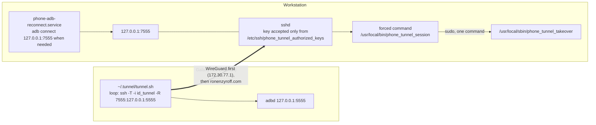

# The self-healing tunnel (since 2026-10-05)

## Why

- **The outage.** The home router is switched off for up to ~4 minutes just before 05:00 every night, by a Shabbat clock that "refreshes" it. The phone's network can also change at any time.
- **What used to happen:**
  - The phone's manual `ssh` gave up after ~90 s and nothing restarted it.
  - The workstation's sshd kept the dead session, and with it **port 7555**, for hours. So even a manual restart failed with `remote port forwarding failed for listen port 7555`.
- **What the owner asked for:** a link that stays reliable on the original port through those outages, unattended, at home and at work, permanently and securely.

## How it works now



There are three parts.

1. **The session survives an outage instead of dropping.**
   - Both sides tolerate **5 minutes of silence**:
     - the phone's `ServerAliveInterval 15` × `ServerAliveCountMax 20`;
     - the workstation's `ClientAliveInterval 15` × `ClientAliveCountMax 20`, in `/etc/ssh/sshd_config.d/05-phone-tunnel.conf`.
   - Over WireGuard the connection's addresses don't change (the phone's VPN address ↔ `172.30.77.1`). So when the router comes back, WireGuard resumes and the same SSH session carries on.
   - **Port 7555 is never released,** and adb's connection just pauses.
2. **If the session really did die** (a long outage, a network change without WireGuard, Termux restarted), the phone's loop reconnects, and **the newest connection takes over port 7555**.
   - **The key's forced command** is `phone_tunnel_session`. It checks who holds 7555.
   - **If an older session of this account holds it,** a root helper (`phone_tunnel_takeover`, the only command allowed by `/etc/sudoers.d/phone_tunnel`) ends that session. The phone then reconnects within seconds and holds the port.
   - **The helper only ends** `sshd: user` sessions that have nothing but the tunnel under them, never an interactive login.
   - **Every decision is logged:** `journalctl -t phone_tunnel`.
3. **adb re-attaches itself.**
   - The user service `phone-adb-reconnect.service` checks every 20 s. If the listener exists but adb doesn't show `device`, it runs `adb disconnect` and then `adb connect 127.0.0.1:7555`.
   - It's enabled with lingering, so it survives logouts and reboots.

## Security

- **No password on the phone.** The phone has its own ed25519 key, `~/.tunnel/id_tunnel`. It was generated on the phone, so the private key never left it.
- **That key can do one thing:** listen on port 7555 for the phone. Its line in the root-owned `/etc/ssh/phone_tunnel_authorized_keys`:

  ```
  restrict,port-forwarding,permitlisten="7555",permitopen="127.0.0.1:9",command="/usr/local/bin/phone_tunnel_session" ssh-ed25519 …
  ```

  - **No shell, no PTY, no agent, no X11.** It can't open local forwards: they're limited to an unused port.
  - **It can't listen anywhere but 7555,** and that's loopback-only, because the server keeps `GatewayPorts no`.
- **Key login is accepted only from that one file.** `AuthorizedKeysFile` points there, so any `~/.ssh/authorized_keys` is ignored.
- **Password login for the human account is unchanged.**
- **The only root power added** is `phone_tunnel_takeover`. It accepts only port 7555 and a numeric PID, and only ends this account's tunnel-only sshd sessions.
- **personal_server's policy** said "password only". This adds one tightly restricted key; its network-security check may now flag `PubkeyAuthentication yes`.

## Long transfers

- **Keepalives don't interrupt anything.** They're only sent after 15 s with **no** traffic. During a transfer, data and SSH window updates flow constantly, so none are sent.
- **An outage pauses the transfer.** The SSH session survives up to 5 minutes, so the bytes resume afterwards.
- **adb itself might abort** a transfer if it waits that long, as with any network blip. Then just rerun it.

## Files

- **Phone:**
  - [`scripts/phone/tunnel.sh`](../scripts/phone/tunnel.sh): the loop;
  - [`scripts/phone/install.sh`](../scripts/phone/install.sh): `keygen`, then `start`.
- **Workstation:**
  - [`05-phone-tunnel.conf`](../scripts/workstation/05-phone-tunnel.conf);
  - [`phone_tunnel_authorized_keys.example`](../scripts/workstation/phone_tunnel_authorized_keys.example);
  - [`phone_tunnel_session`](../scripts/workstation/phone_tunnel_session);
  - [`phone_tunnel_takeover`](../scripts/workstation/phone_tunnel_takeover);
  - [`sudoers.d_phone_tunnel`](../scripts/workstation/sudoers.d_phone_tunnel);
  - [`phone_adb_reconnect.sh`](../scripts/workstation/phone_adb_reconnect.sh) and [`phone-adb-reconnect.service`](../scripts/workstation/phone-adb-reconnect.service);
  - [`phone_tunnel_watch_log.sh`](../scripts/workstation/phone_tunnel_watch_log.sh) (an optional 15-second logger for testing).

## Operating it

- **Check from the workstation:**
  - `ss -ltn 'sport = :7555'`;
  - `adb -s 127.0.0.1:7555 shell echo ok`;
  - `journalctl -t phone_tunnel --since -1h`;
  - `systemctl --user status phone-adb-reconnect`.
- **Phone log:** `~/.tunnel/log` in Termux.
- **After a phone reboot:**
  1. Port 5555 is gone, as before, so redo the Wireless-debugging bootstrap (README §8).
  2. Then in Termux: `bash ~/.tunnel/tunnel.sh` under `nohup`, or rerun `install.sh start`.
  3. The key stays.
- **Stop:** `pkill -f .tunnel/tunnel.sh` in Termux.
- **If the WireGuard endpoint IP ever changed** (it hasn't across the nightly restarts), the phone's WireGuard app might need a toggle. That's the owner's to do. Meanwhile the loop falls back to `ronenzyroff.com`.

## History of 2026-10-05

| Time | What happened |
|---|---|
| 04:45 | First version: two password-based loops (7555 and 7556), with sshd dropping dead sessions after 90 s |
| 04:54–04:56 | Router restart: internet down 04:54:20–04:56:35. Both tunnels dropped and were back at 04:56:50, 15 s after the internet returned |
| 05:03 | The owner asked for a single reliable port, permanently and securely. This version replaced the first: the phone key, 5-minute tolerance, takeover. Its first connection found the old password session on 7555, ended it, and held the port 4 s later |
| 05:04:53–05:07:53 | A 3-minute outage was simulated by dropping the tunnel's traffic at the workstation's firewall (`iptables -I INPUT -s 172.30.77.2 -p tcp --dport 22 -j DROP`, removed automatically by a root `systemd-run` timer) |
| 05:08:34 | **The session survived.** The same sshd process (pid 3597095) still held 7555. There was no takeover and no reconnect |
| ~05:09:15 | adb answered again (`ok`), on the same session |

**What the test shows:**
- An outage of a few minutes **does not drop the tunnel**.
- **Traffic resumes up to ~1–2 minutes after the network returns.** TCP's retransmission back-off grows during the outage (the RTO had reached 53 s), so the next retry can come that late.
- So a 3-minute router outage means about 4–5 minutes without adb, followed by an automatic resume. Nobody has to touch anything.
- **A faster resume** would need tuning the workstation's TCP retransmission ceiling. That's not done, because it would also make TCP connections give up sooner.

